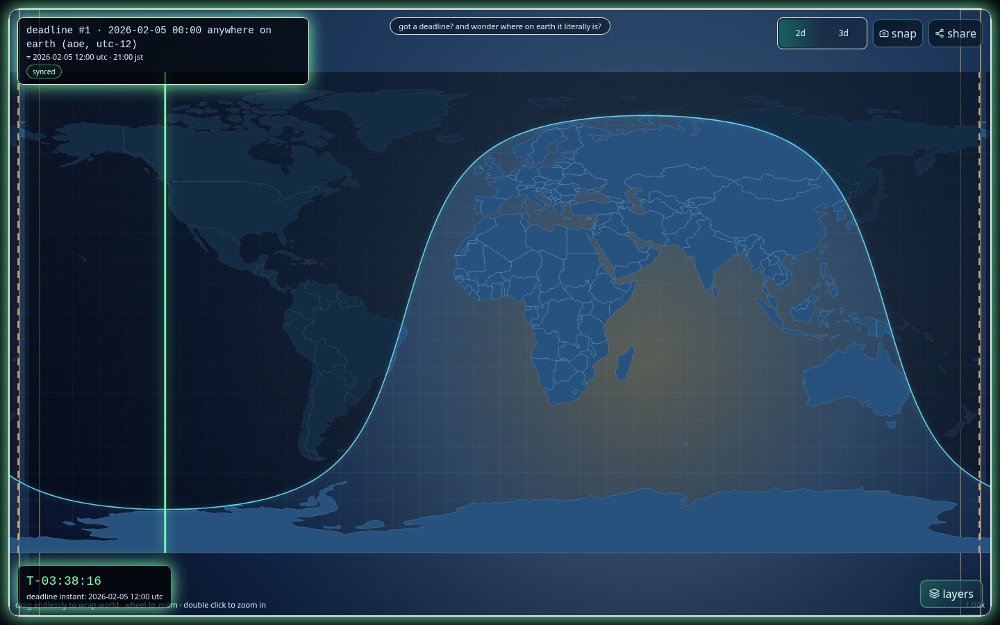

# deadLINE (v0.4.1)



Minimal OSS web app that visualizes a deadline as moving civil/solar lines over Earth (2D map + 3D globe). Vibe coded on [5.3-Codex release day](https://openai.com/index/introducing-gpt-5-3-codex/).

Core greeting requirement in UI copy: `got a deadline? and wonder where on earth it literally is?`
README requirement: keep a current demo screenshot at the very top so project purpose is obvious in first glance.

## stack

- react + typescript + vite
- luxon (timezone-safe parsing)
- d3-geo canvas (2d)
- react-globe.gl / globe.gl / three (3d globe with drag/zoom orbit controls)
- radix switch + custom segmented controls (no browser checkbox UI)
- tsparticles (`@tsparticles/react` + slim engine) for near-deadline sparks
- zustand + localStorage
- vitest + fast-check + playwright
- vite pwa (offline shell + cached static assets)
- privacy-aware GA4 analytics (prod only, DNT-aware)
- safe deadline slots + draft/apply workflow (prevents accidental overwrites)

## local setup

```bash
npm install
npm run hooks:install
npm run dev
```

Open the local URL shown by Vite (typically `http://localhost:5173`).

## local testing

Run all quality checks:

```bash
npm run quality:full
```

Or run pieces individually:

```bash
npm run format:check
npm run lint
npm run typecheck
npm run test
npm run build
npm run perf:report
npm run test:e2e
npm run test:e2e:gh-pages
npm run ui:capture
npm run screens:check
```

Run production preview locally:

```bash
npm run build
npm run preview -- --host 0.0.0.0 --port 4173
```

Then open `http://localhost:4173`.

Run GH-pages subpath smoke locally:

```bash
GH_PAGES_REPO=deadline GH_PAGES_PORT=4176 npm run test:e2e:gh-pages
```

Demo mode for deterministic docs/screens capture:

```bash
http://localhost:5173/?demo=1&view=2d
http://localhost:5173/?demo=1&view=3d
http://localhost:5173/?demo=1&view=detail
```

## manual smoke checklist

1. Confirm default view is map-first: only `deadline chip`, `2d/3d + snap/share`, `layers`, and `countdown hud` are always visible.
2. Open deadline drawer from the chip, edit date/time/timezone, and verify map only updates after `apply`.
3. Set timezone to `Anywhere on Earth (AoE, UTC-12)` and confirm it is accepted.
4. Toggle between `2d` and `3d`; verify map/globe remain interactive.
5. Open layers panel and toggle overlays (`solar lines`, `civil timezones`, `terminator`, `landmarks`).
6. Set detail lens to `on`, then `off`, and verify smooth transition in 2d view.
7. Set location with geolocation or map-pick and confirm distance readout in info drawer.
8. If deadline is >24h away, use `unwind` + speed controls and verify cycle countdown updates.
9. Use `snap` to export a PNG and `share` to copy encoded URL state.
10. In 3d, hover globe and verify tooltip includes civil time, solar time, and delta-to-target.
11. Enable debug mode (`?debug=1` or `Ctrl+Shift+D`) and verify overlap warnings/capture tools.
12. Validate edge-safe HUD on mobile width (`390x844`): chip/top controls/countdown/layers do not overlap.

## optional timezone polygon accuracy mode

By default, civil-time rendering uses UTC offset bands.

To enable real timezone polygons:

1. Add `public/data/timezones/timezones.geojson`.
2. Start app and enable `settings -> accuracy mode (timezone polygons)`.
3. Status should show `timezone polygons loaded`.

Dataset format details are in `public/data/timezones/README.md`.

## deploy: github pages (free)

This repo includes `.github/workflows/deploy-gh-pages.yml`.

1. Push `main` to GitHub.
2. In GitHub repo settings, open `Pages` and set source to `GitHub Actions` (if not auto-set).
3. Wait for workflow `deploy gh pages` to pass.
4. Open the Pages URL from workflow output or repo Pages settings.
5. Run online smoke checks from `docs/deploy.md`.

## deploy: vercel (free)

1. Import the GitHub repo in Vercel.
2. Framework preset: `Vite` (auto-detected).
3. Build command: `npm run build`.
4. Output directory: `dist`.
5. Deploy.
6. Run online smoke checks from `docs/deploy.md`.

## online verification checklist

1. Open deployed URL in a fresh browser profile/tab.
2. Confirm map renders and countdown runs.
3. Toggle to globe and confirm illuminated hemisphere + solar meridian render.
4. Confirm 3d solar now/deadline paths are visible and interactive.
5. Verify city search/location and settings work.
6. Optional: enable browser notifications and verify permission prompt works.
7. Optional offline check: load once, then disable network in devtools and refresh.

## docs

- docs index: `docs/README.md`
- spec: `docs/spec.md`
- architecture: `docs/architecture.md`
- deploy: `docs/deploy.md`
- gh-pages hardening: `docs/gh-pages.md`
- render loop/perf model: `docs/render-loop.md`
- ui guide: `docs/ui.md`
- ui controls audit: `docs/ui-controls.md`
- testing + quality gates: `docs/testing.md`
- versioning: `docs/versioning.md`
- licenses: `docs/licenses.md`
- agent logs: `docs/agents/implementation/`
- changelog: `CHANGELOG.md`

## license

Apache-2.0 (`LICENSE`).
